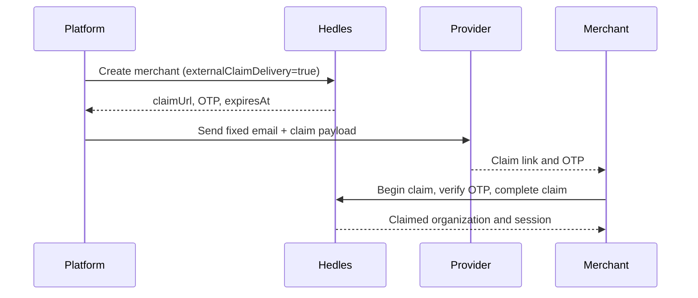

# Hedles API examples

Bun + TypeScript examples for tenant claims, sessions, wallets, pay-ins, and payouts.

## Quick start

Requires [Bun](https://bun.sh/) 1.3.14+, a Hedles tenant, and either a session token or P-256 API key.

```sh
git clone https://github.com/hedlesio/examples.git
cd examples
bun install
cp .env.example .env
```

Secrets live in `.env`; operation inputs are CLI flags. Run any command with `--help`.

Commands default to `https://api-dev.hedles.io`. Production operations are real: pass
`--api-url https://api.hedles.io` only intentionally. Amounts use atomic units.

## Authentication

| Variable | Purpose |
| --- | --- |
| `HEDLES_SESSION_TOKEN` | Existing bearer token |
| `HEDLES_API_PUBLIC_KEY` | Compressed P-256 public key |
| `HEDLES_API_PRIVATE_KEY` | 32-byte P-256 private key in hex |

Authenticated commands use `HEDLES_SESSION_TOKEN` when set; otherwise they create a session with the API
key pair. Wallet creation and cosigned payouts may still need the key pair to sign activities.

## Commands

### Claim a tenant

```sh
bun run claim \
  --tenant-id your-tenant-uuid \
  --claim-code 123456 \
  --user-name "Example Owner"
```

Defaults: owner name to the verified email and custody mode to `cosigned`. Use
`--custody-mode custodial` for Hedles-authorized wallet operations.

If no API keys are configured, the command generates a pair and prints the private key once. Store it
immediately.

### Onboard and claim a merchant with a self-managed OTP

This command is for a platform explicitly allowlisted by Hedles for external claim delivery. The authenticated
user must be an Admin, and the new merchant is created directly under that platform.

```sh
bun run merchant-otp \
  --name "Example Merchant" \
  --email owner@example.com \
  --user-name "Example Owner"
```

The command runs the complete example: the platform creates the directly owned merchant, receives the OTP,
builds the payload its provider must send to the pre-registered email, verifies that same code as the merchant,
completes the claim with a newly generated P-256 API key, and obtains the merchant's first session. It prints the
delivery payload and the new merchant credentials once. Store the private key immediately.

The example uses the returned delivery object directly so it remains runnable without choosing an email vendor.
In production, send that object through the partner's provider and perform the `claim` command when the merchant
submits the code. Do not accept a replacement email address or claim URL from the caller.



Send the delivery through your own trusted channel. A transport retry must reuse the same returned code.
Calling the authenticated resend-claim endpoint is an intentional rotation that invalidates the previous code.
The public claim/send-code endpoint never returns a code.

### Renew an expired self-managed OTP

Claim OTPs expire after 24 hours. The API rejects an expired code with HTTP 401 and
`reason: "invalid_or_expired_code"`, then deletes it. An allowlisted platform Admin can rotate it for a directly
owned, unclaimed merchant:

```sh
bun run merchant-otp-renew --tenant-id your-merchant-uuid
```

The response contains the new code and `expiresAt`; the previous code is invalid. OTP issuance has a 60-second
cooldown. During that window the command reports `rotated: false` and `existingCodeStillValid: true`, because no
new code is returned and the existing code remains valid. Keep the original delivery until it expires or is
successfully rotated.

### Create a session

```sh
bun run session
```

Signs an identity proof and returns a one-hour Hedles token. Organization bootstrap is automatic;
`--organization-id` overrides it.

### Create a wallet address

```sh
bun run wallet
bun run wallet --chain-type xrp
```

Defaults to `evm`. Supported types: `evm`, `solana`, `bitcoin`, `bitcoin-testnet`, `litecoin`,
`litecoin-testnet`, `xrp`, and `tron`.

### Create a pay-in

```sh
bun run payin \
  --chain your-chain-key \
  --asset your-asset-key \
  --amount 1000000 \
  --reference invoice-123
```

`--reference` is optional; `--expires-in` defaults to 3600 seconds.

### Create and sign a payout

```sh
bun run payout \
  --chain your-chain-key \
  --asset your-asset-key \
  --from source-address \
  --to recipient-address \
  --amount 1000000 \
  --note invoice-123
```

`--note` is optional. XRPL supports `--destination-tag <uint32>`. When required, the command signs each
exact activity body and handles up to two stages.

## Shared options

| Option | Default |
| --- | --- |
| `--api-url` | `https://api-dev.hedles.io` |
| `--organization-id` | Auto-discovered |
| `--help` | Prints command options |

## Development

```sh
bun run check
```

Runs TypeScript, Biome, and Bun tests.

## Security

- Never commit `.env`.
- Treat private keys and session tokens as secrets.
- Never modify a prepared activity body before signing.
- Test financial operations against development first.

## Links

- [Development API docs](https://api-dev.hedles.io/docs)

MIT
